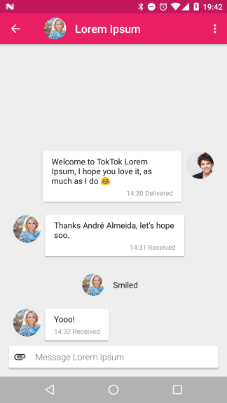

We are a focused effort to bring high quality privacy enhancing software to
everybody.

# Current focus

Focus means we work on a small set of projects (one or two at a time) and
concentrate all our work on getting those projects finished completely before
moving on to the next target.

Our current focus is:

-   Create a [full specification](spec.html) of the Tox protocol.
-   Create a free [executable model](https://github.com/TokTok/hs-toxcore) of
    that protocol.
-   Slowly improve the existing Tox protocol
    [implementation](https://github.com/TokTok/c-toxcore) written in C. We
    build new releases with mostly cleanups, minor bugfixes, and small
    non-intrusive features.

A new implementation in Rust is [in progress](https://github.com/tox-rs/tox).
It evolves together with the model and is tested against the specification.

Neither the Tox protocol nor the implementation have undergone peer review,
and its exact security properties and network behaviour are not
well-understood, yet. We are actively working on improving that situation.
Until said peer review, Tox is not recommended for use cases that require
proven, high-assurance security. If you find any potential security issues,
don't hesitate to report them on the [bug
tracker](https://github.com/TokTok/c-toxcore/issues).

# Contributing

Check out our [roadmap](roadmap.html) and
[changelog](changelog/c-toxcore.html). If you want to help, you could start by
[reviewing](reviews.html) pull requests. You can view the list of
[repositories](repos.html) and their build status. If one of them has low
coverage, you could familiarise yourself with the code by writing some tests.

# Contact us

If you're interested in what we're doing, feel free to stop by on IRC in
[#toktok on LiberaChat](irc://irc.libera.chat/#toktok). Feel free to stick
around and discuss TokTok related topics. If you do join, please stay on topic
and respect other people.

# Get started

[Collection of resources for developers.](get-started.html)
