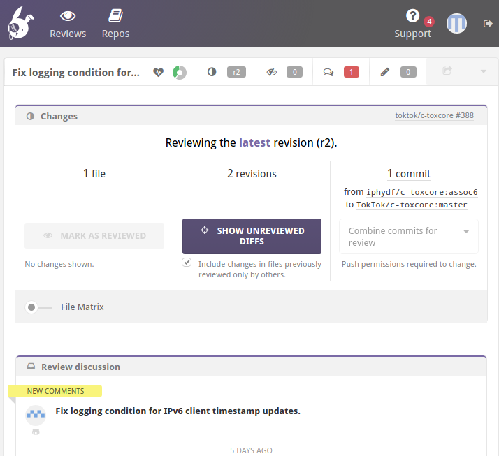
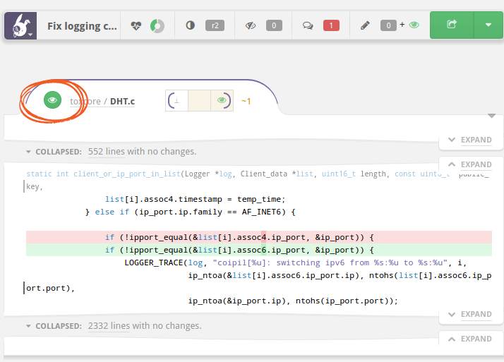
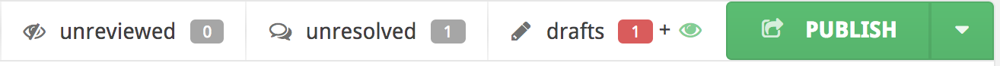
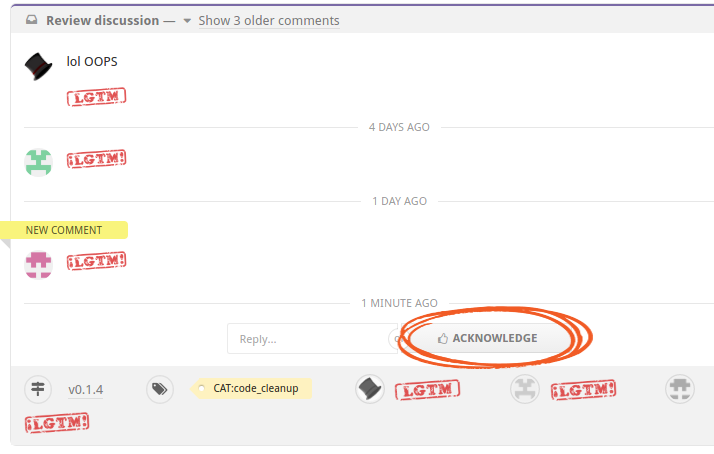
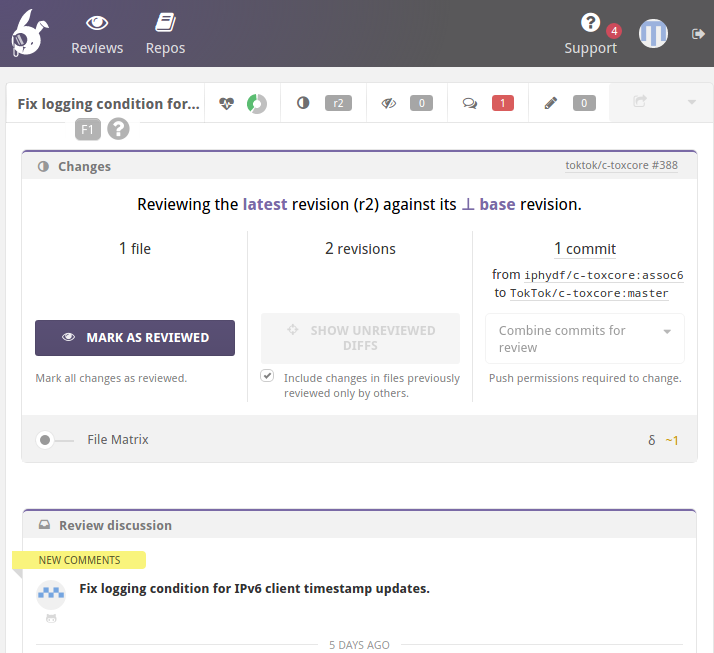

The TokTok review process requires at least three reviews for every pull
request. One of the reviews must be from a developer. The two other reviews
can be from a developer but can also be from the community. The idea is that
the community, i.e. the Tox/TokTok users, can have direct influence on how the
code and surrounding elements evolve. This page explains to a new GitHub user
how to engage in a community review.

# Step 1: Look over the PR list

Take a look at the [pulls](pulls.html) page on this website. It lists all the
repositories that currently have open pull requests.

You can start by reading through the PR titles and see if anything catches
your interest. You can also just randomly click on some PR numbers and enter
the review. Everyone is allowed to review any number of PRs they like. You can
post review comments and engage in discussions. You are welcome, and we will
be happy to learn about any questions, concerns, or thougths you'd like to
express.

# Step 2: Log in to Reviewable

-   Open the Reviewable link in the "#" column on the page or on GitHub in the
    PR description itself.
-   It will ask you for some permissions. You can safely grant them.
    Reviewable will not write to your repositories, it only needs those to be
    able to edit comments and add the Reviewable link.
-   You should now see a page like the one below.
-   As you can see, there is a **SHOW UNREVIEWED DIFFS** button. When you
    click this button, you should be able to see the changes under review.

# Step 3

-   Scroll down to see the file changes. You will find something like the
    screenshot below. Here, we see that someone changed a `4` into a `6` in a
    file named `DHT.c`. The PR description explains why this was done: "Fix
    logging condition for IPv6 client timestamp updates".
-   Now comes your review: your task is now to check whether the change makes
    sense. In this example, we see that `assoc4` was checked in an IPv6 code
    block. Now that is fixed. Seems legit. :)
-   If you don't understand what this change does, ask a question. We will be
    happy to explain what we're doing. This helps not only you, but also
    anyone in the future who may be digging through the commit history. It
    also helps us keep a high standard of documenting changes and maintains
    transparency towards the community and potential new contributors. Last
    but not least, explaining a change can help the author [find
    mistakes](https://en.wikipedia.org/wiki/Rubber_duck_debugging).
-   To ask a question or express a concern with a change, click the line you
    want to comment on. This opens a text editor where you can write your
    comment in
    [Markdown](https://github.com/adam-p/markdown-here/wiki/Markdown-Cheatsheet)
    format.

# Step 4

When you are done with a file, click the eye symbol in the corner. This marks
the file as reviewed. Even if you have put comments on it, still mark it as
reviewed, which just means that you saw it. It does not mean that you consider
the file OK. Your comments need to be explicitly marked resolved by you
clicking the **ACKNOWLEDGE** button.

# Step 5

As a last step, after having all files reviewed, click the **PUBLISH** button
on the top right of the UI, marked in the image below.

You can show the **File Matrix** to see whether you have reviewed all the
files.

The red "1" next to the speech bubbles means that there are some comments that
need your attention. Click on the speech bubbles button to see them. Clicking
on it again will show you the next comment and eventually wraps back to the
first one.

For each comment, you can either write a reply yourself, or simply press the
**ACKNOWLEDGE** button to mark them as seen.

# Alternative: mark all files as reviewed

Instead of marking each individual file as reviewed, you can also simply
review all files and then click the **MARK AS REVIEWED** button at the top to
mark all files as reviewed at once.

# That's all, folks

Now you've done a community review! Well done :) and thank you very much for
helping us maintain our transparency and quality standards. If you have any
questions, don't hesitate to ask.
